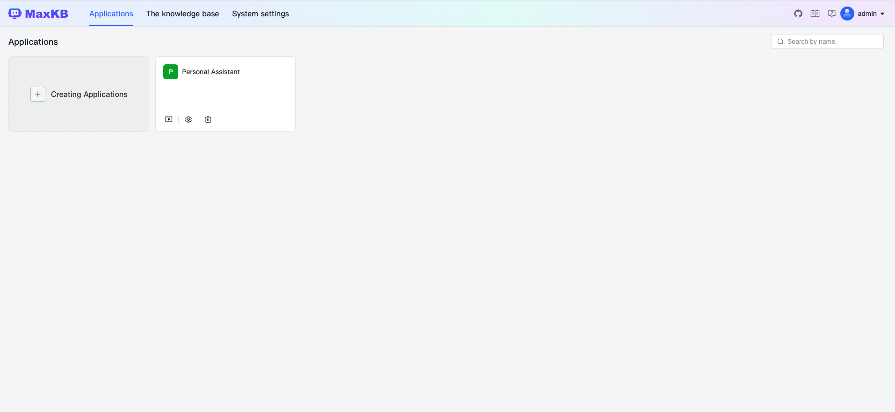
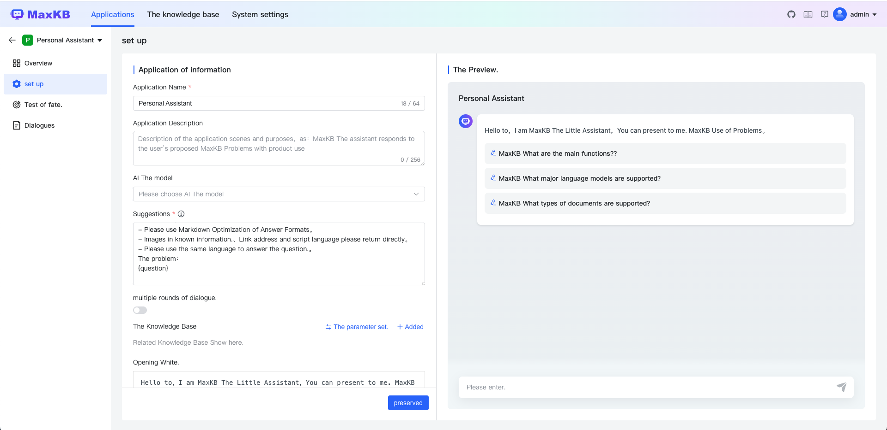
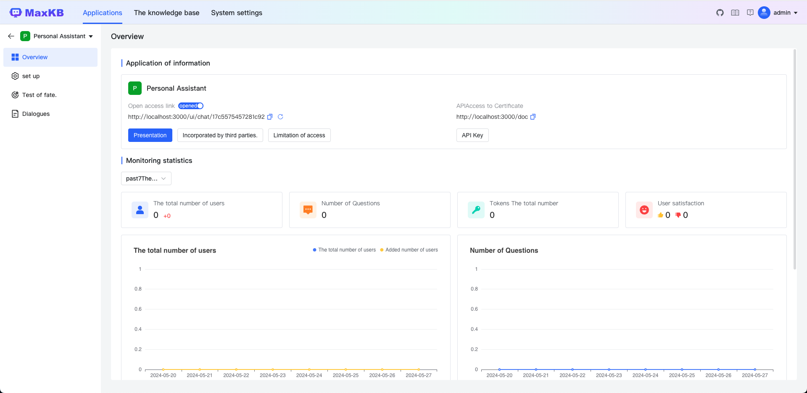

<p align="center"></p>
<h3 align="center">Based on LLM Big Language Model Knowledge Base Questions System</h3>
<p align="center">
  <a href="https://www.gnu.org/licenses/old-licenses/gpl-3.0"></a>
  <a href="https://app.codacy.com/gh/1Panel-dev/maxkb?utm_source=github.com&utm_medium=referral&utm_content=1Panel-dev/maxkb&utm_campaign=Badge_Grade_Dashboard"></a>
  <a href="https://github.com/1Panel-dev/maxkb/releases/latest"></a>
  <a href="https://github.com/1Panel-dev/maxkb"></a>    
  <a href="https://hub.docker.com/r/1panel/maxkb"></a>  
</p>

<hr/>
This is English version. For the latest updates, please visit the original at:

 - <https://github.com/1Panel-dev/maxkb>

<hr>
MaxKB It is based on LLM Big Language Model Knowledge Base Questions System. MaxKB = Max Knowledge Base, It is designed to be the strongest brain of the company. 

- **Open the box.**:Support for direct upload of documents. Automatic retrieval of online documents, Support text automatic separation. to Quantity. Intelligent Questions Interactive Experience；
- **Smoothly Embedded.**:Support zero-coding rapidly embedded into third-party business systems；
- **Multi-Model Support**:Supporting large-scale connectivity models, Included Ollama Local private model.（as Llama 2、Llama 3、qwen）、A Thousand Questions、OpenAI、Azure OpenAI、Kimi、Intelligence AI、Starfire and a hundred-thousand-layer model. 

## Start quickly.

```
docker run -d --name=maxkb -p 8080:8080 -v ~/.maxkb:/var/lib/postgresql/data 1panel/maxkb

# User Name: admin
# The code: MaxKB@123..
```

## Development

The [official guide](https://github.com/1Panel-dev/MaxKB/wiki/%E5%BC%80%E5%8F%91%E7%8E%AF%E5%A2%83%E6%90%AD%E5%BB%BA)

### Prerequisite

Install Python 3.11

```
# Add the deadsnakes repository
sudo add-apt-repository ppa:deadsnakes/ppa

# Update package lists
sudo apt update

# Install Python 3.11
sudo apt install python3.11
```

Enable Python virtual env

```
# Install the venv package for Python 3.11
sudo apt install python3.11-venv

# Make a folder for venv virtual environments
mkdir ~/.venvs

# Create a new venv virtual environment with Python 3.11 in it
python3.11 -m venv ~/.venvs/my-venv-name

# Activate the new venv
source ~/.venvs/my-venv-name/bin/activate
```
Exit from the virtual environment

```deactivate```

Setup `peotry`

```
# Install poetry
pipx install poetry

# Install application dependencies
poetry install

# Check install debug
poetry debug info

# Set Python verion
poetry env use 3.11
```

Update `config_example.yml` file & rename it to `config.yml`

### Start Backend system

Run Postgres Docker image (equals or above:15.x)  

```docker compose -f installer/docker-compose-dev.yml up -d```

Start main application (python:3.11.x)

```poetry python main.py start```

You might need to change the following paths
```
main.py --> looking for HF_HOME --> change it to the source code folder 
apps/smartdoc/const.py --> CONFIG --> abspath('./') --> change it to the source code folder

# config file
EMBEDDING_MODEL_PATH: ./models

# Change cache dir for Tokenizer
apps/common/config/tokenizer_manage_config.py  ---> cache_dir
```

### Start Frontend system

```
# Frontend code
cd ui

# Node version >= v18.20.2 -->  nvm use v18.20.2 
yarn install

# Start UI app
yarn dev
```

Inital credentials
```
# User Name: admin
# The code: MaxKB@123..
```


## UI Showing

<table style="border-collapse: collapse; border: 1px solid black;">
  <tr>
    <td style="padding: 5px;background-color:#fff;"></td>
    <td style="padding: 5px;background-color:#fff;"></td>
  </tr>
  <tr>
    <td style="padding: 5px;background-color:#fff;"></td>
  </tr>
</table>

## Technical Stack

-   The front:[Vue.js](https://cn.vuejs.org/)
-   The back. [Python / Django](https://www.djangoproject.com/)
-   LangChain:[LangChain](https://www.langchain.com/)
-   Veto Database:[PostgreSQL / pgvector](https://www.postgresql.org/)
-   The big model. Azure OpenAI、OpenAI、A hundred-thousand model. [Ollama](https://github.com/ollama/ollama)、A Thousand Questions、Kimi、Intelligence AI、The Star Fire.


## License

Copyright (c) 2014-2024 Flying to the cloud. FIT2CLOUD, All rights reserved.

Licensed under The GNU General Public License version 3 (GPLv3)  (the "License"); you may not use this file except in compliance with the License. You may obtain a copy of the License at

<https://www.gnu.org/licenses/gpl-3.0.html>

Unless required by applicable law or agreed to in writing, software distributed under the License is distributed on an "AS IS" BASIS, WITHOUT WARRANTIES OR CONDITIONS OF ANY KIND, either express or implied. See the License for the specific language governing permissions and limitations under the License.
